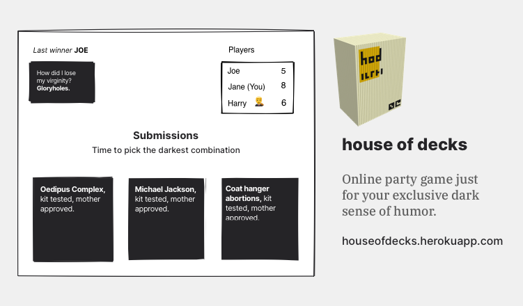
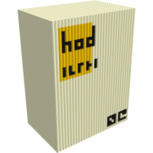

# house of decks

This is an online clone of [Cards Against Humanity](https://cardsagainsthumanity.com/) that you can find many different card decks to enjoy the time with your friends.

Online video call recommended while playing this game.

You can find [WIKI](https://www.notion.so/keremciu/house-of-decks-a688fc6e6d8e48bd98984f1bbcfe52fb) here.

### Commands

`npm run start`

#### For development

`npm run dev`

### Credits

If you play this game and like it; Please buy it on [Cards Against Humanity](https://cardsagainsthumanity.com/) website.
Don't miss this chance to contribute their creativity.

I used [this repository](https://github.com/crhallberg/json-against-humanity) to reach some cards.

### License

This repository is just an online clone which follows Cards Against Humanity license.

Cards Against Humanity is distributed under a Creative Commons Attribution-ShareAlike 4.0 International Public License.
